# AI学习助手程序文档
# 1. 项目概述
## 1.1 项目简介
本项目旨在实现低成本 高集成 易部署的本地无人值守和远程监督的AI学习助手,为保隐私性,SSH没有选择脸部作为判断对象  
在日常学习中时常要面对监护人值守时的高昂时间成本和用监控远程值守时的疏忽,Student Studying Helper(以下简称SSH)找到了他们之间的平衡点,通过本地AI值守加远程通知的方式解决了这个问题

## 1.2 创新点
- 将计算机视觉分类任务和日常生活场景结合
- 可导入自定义模型,解决满足更多场景需求

# 2. 技术架构
## 2.1 技术栈图示
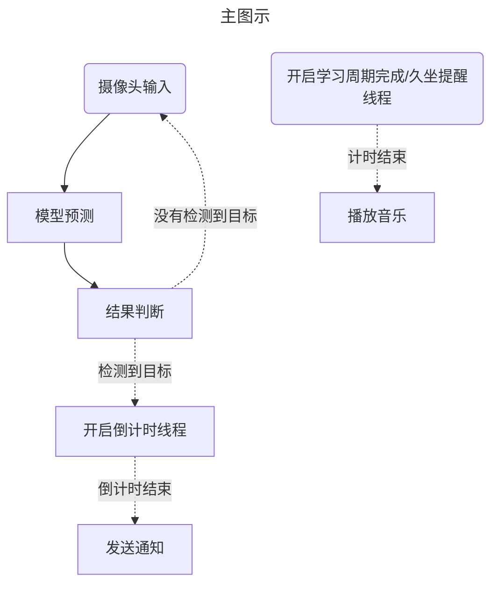
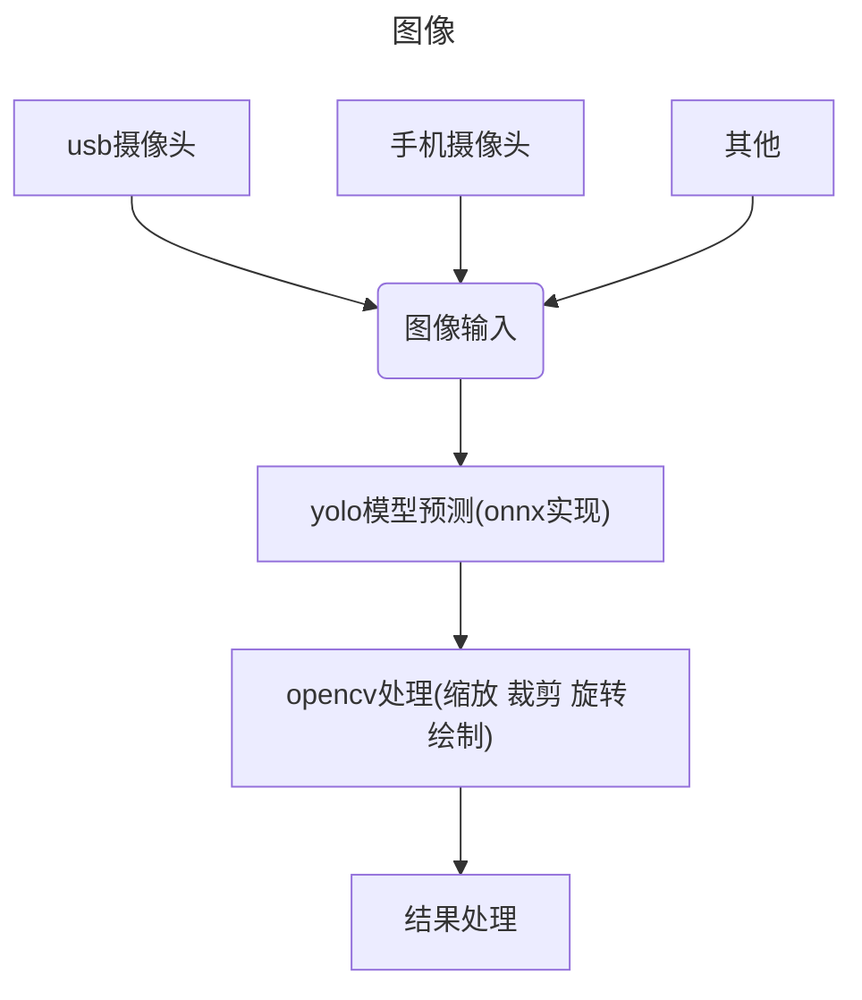
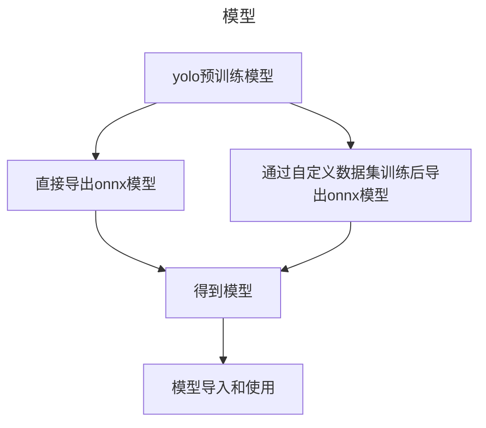
## 2.2 模块说明
- 图像采集
    - usb摄像头
    - 手机摄像头
    - 其他
- 图像处理
    - opencv
    - PIL
    - numpy
    - ...
- 模型
    - yolo预训练模型
    - 自定义数据集训练的模型
- 网络通信
    - mailio
    - boost
    - ...
- 数据持久化
    - 封装QSetting实现对ini文件的读写保存


## 2.3 模型训练
```python
# 安装依赖库 (如果未安装)
# pip install ultralytics

from ultralytics import YOLO

# --------------------------------------------------
# 步骤1: 准备数据集
# 数据集目录结构建议:
# dataset/
# ├── train/
# │   ├── images/
# │   └── labels/
# └── val/
#     ├── images/
#     └── labels/
# --------------------------------------------------

# 步骤2: 创建数据集配置文件 (dataset.yaml) 最好放在同级目录下避免找不到
# 用文本编辑器创建文件：
'''
path: /path/to/dataset
train: train/images
val: val/images

names:
  0: people  
  1: phone <--这个名称可以根据需要修改,加载到SSH时可以让SSH判断是否有它
  ...
'''

# --------------------------------------------------
# 步骤3: 训练模型
# --------------------------------------------------
# 加载预训练模型 可以到官网比较版本差别
model = YOLO("yolov8n.pt")

# 开始训练
results = model.train(
    data="dataset.yaml",  # 数据集配置文件路径
    imgsz=640,           # 输入图像尺寸
    epochs=100,          # 训练轮次
    batch=8,             # 批次大小
    name="custom_train"  # 训练结果保存名称
)

# --------------------------------------------------
# 步骤4: 使用训练好的模型进行推理
# --------------------------------------------------
# 训练完成后，在 runs/detect/custom_train/weights 目录下找到最佳模型
trained_model = YOLO("runs/detect/custom_train/weights/best.pt")

# 进行预测
results = trained_model.predict("test_image.jpg", save=True)
```
## 2.4 模型导出
```python
#导出为onnx模型以便SSH加载
from ultralytics import YOLO

# 此处应填写训练好的模型路径
model = YOLO("yolo11n.pt")
# 导出为ONNX格式
path = model.export(format="onnx")
```
将模型重命名为yolo11n.onnx后放入SSH根目录下的models文件夹中,考虑到大多数电脑配置,SSH暂不支持加载自定义模型  
如果非要加载,请这样做
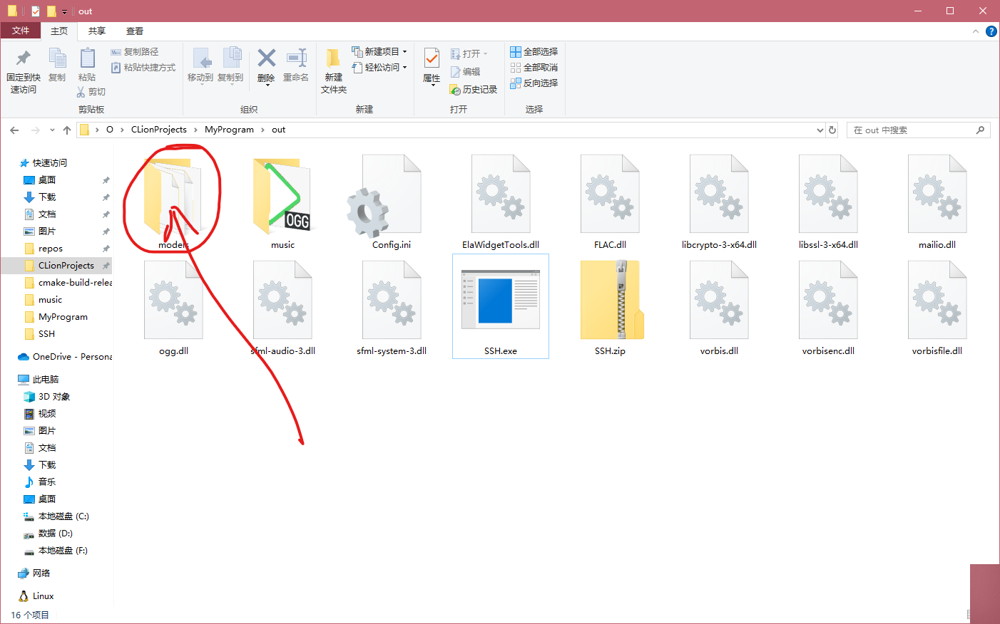
再在"学习"页面点击开始即可,此过程不会有替换模型提示
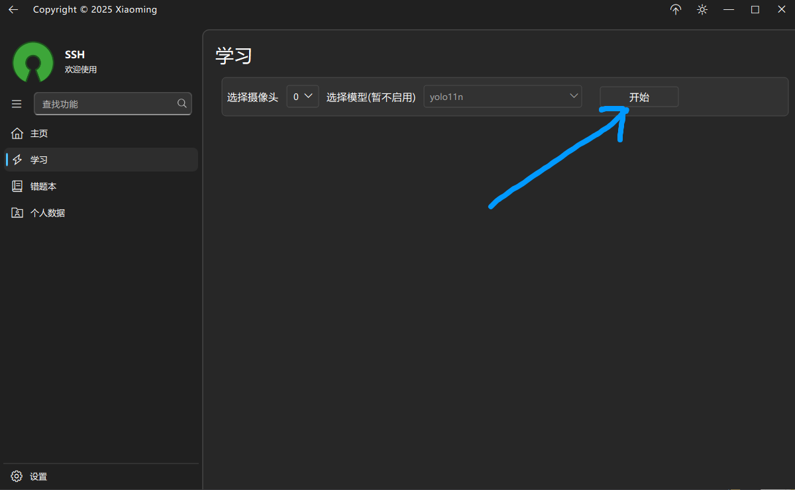


# 3. 使用说明
## 3.1 使用演示
首次使用应先在设置里配置  
邮箱秘钥的配置在最后说明  
休息时间为经过多少秒播放音乐提示
上报时间为当人离开画面或视野中有违规物品(例如手机),经过多少秒后上报
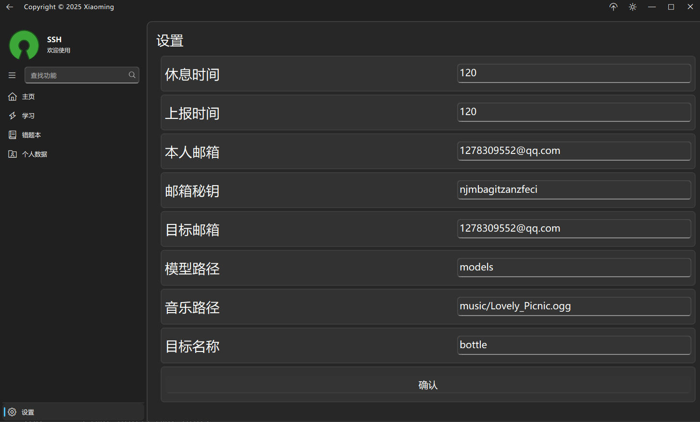
SSH会自动寻找摄像头,红色箭头所指为摄像头标号,下拉可以选择
蓝色所指为模型选择,暂不开放
最后点击开始即可
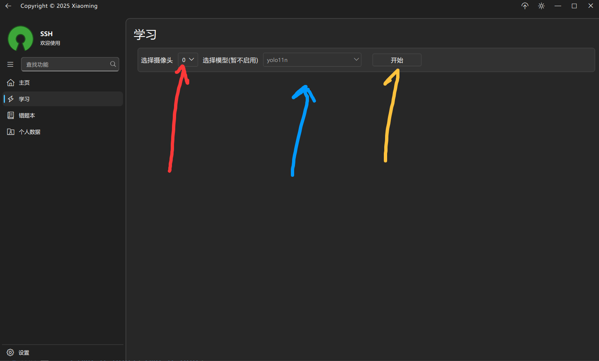
SSH会自动开始工作,当人离开画面或视野中有违规物品(例如手机),经过上报时间后会发送邮件  
开始或关闭都会将摄像头状态上报,如右下角所示,收到了邮件提醒
SSH会在画面上绘制调试信息,方便查看  
*画面分辨率跟随摄像头而定
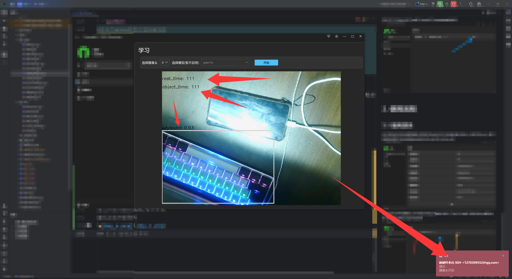
邮箱秘钥获取步骤,以qq邮箱为例,若其他邮箱不支持请切换到qq邮箱
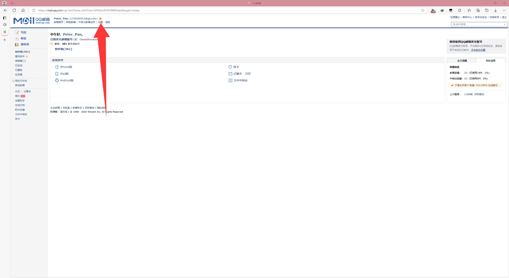
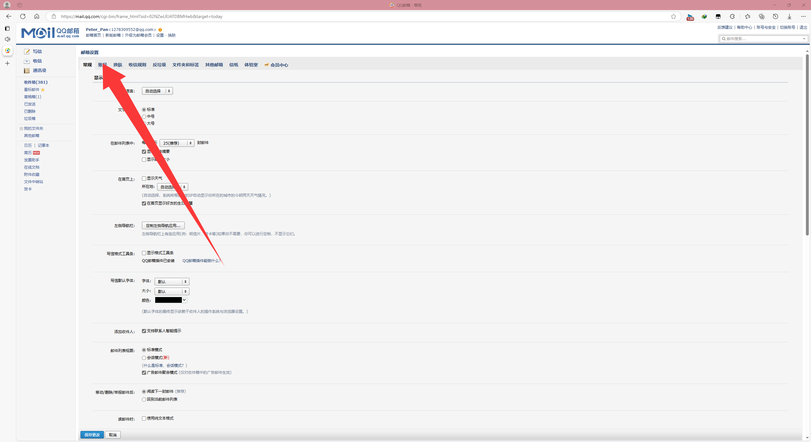
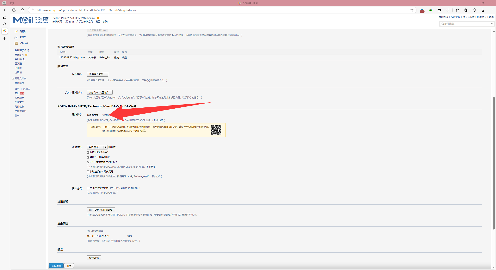
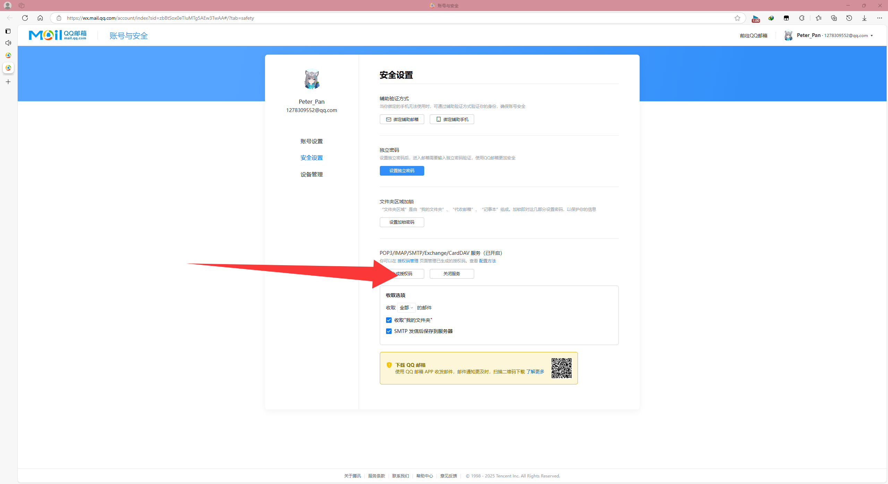

# 4. 测试验证
见视频
# 5. 其他
手机摄像头代替usb摄像头的使用方法:
打开`https://iriun.com/`
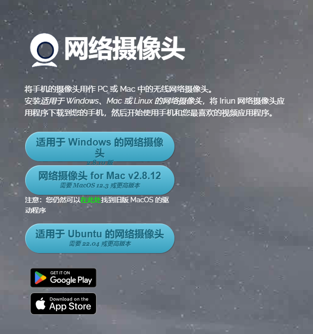
手机电脑都安装iriun后保持在同一局域网内,切手机电脑都打开iriun,将会自动连接,连接后您可以在"学习"页面选择手机摄像头作为输入